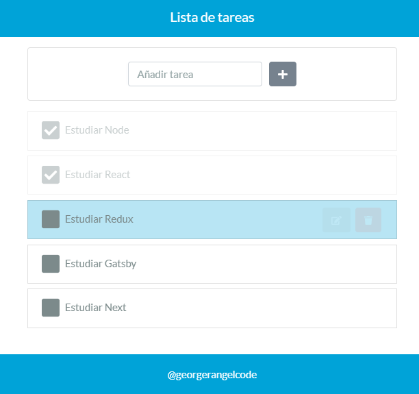
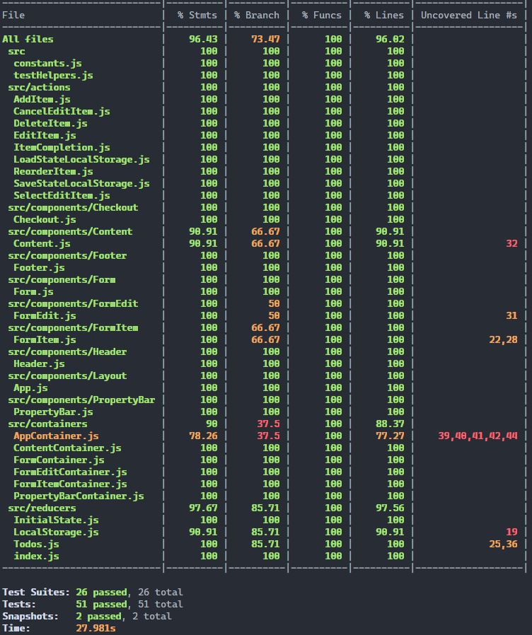

# Lista de tareas

Lista de tareas usando React y Redux.

## Captura de la app

## Captura informe de pruebas unitararias de la app

[Ver la aplicación en https://todo-list.georgerangelcode.vercel.app](https://todo-list.georgerangelcode.vercel.app)

## ¿Cómo funciona?

Requiere Node.JS > 10

- `npm install` Para instalar las dependencias.
- `npm run start` Para iniciar el entorno de desarrollo.
- `npm run build` Para generar el entorno de producción.
- `npm run test` Para ejecutar las pruebas unitarias.
- `npm run test:coverage` Para generar el informe de las pruebas unitarias.

## Licencia

MIT
